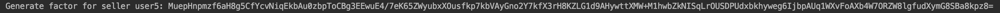

## Oblivious transfer demo

### Start up

Go to ``./oblivious-transfer-server``, run 

```bash
./gradlew bootrun
```

Go to ``./oblivious-transfer-client``, run 

```bash
./gradlew bootrun
```

Then request ``http://localhost:8081/quotes/5``

### Demo description

##### Scenario：

1. There are some sellers to sell a product, and the price is sensitive. 
2. A server manages all sellers' price information. 
3. A buyer wants to get the price of a specific seller, but he doesn't want to expose which seller's price he is asking.
4. Server only want to return the requested price, but not all. 

##### How to protect both buyer and seller privacy in this demo

1.  when server is starting, all prices are generated. 

   

2. In server's endpoint, random message for oblivious transfer is presented. 

   

3. And the public key of the server is also available. 

   

4. Then we can trigger buyer client to make a request for a specific, e.g., user5. 

   ```bash
   http://localhost:8081/quotes/5
   ```

5. And buyer client will generate a random factor, and this factor will be **encrypted by oblivious transfer cryptosystem**. In this case, the factor is encrypted by public key at first, and xor the random message of user5. Then the buyer sends this factor to server, but will **not tell server which seller this factor belongs to**.

   

   

6. When the server receives the factor, it **cannot know which seller is searched**. So server will **decrypt by oblivious transfer cryptosystem** to get factors for all sellers. (Only the factor for user5 is correct, but the server doesn't know.) In this case, the server xor the encrypted factor with each random message of seller, and then decrypt with its private key.

   

   

7. Server uses those factors to xor with the price and send to buyer. 

8. Buyer gets the prices and xor with the factor generated by user5, he can only get the price of user5, other prices are meaningless.

   

### Some other scenarios

1. A has some coupons, A want to give only one of them to B, B doesn't want A know which one he actual got.
2. A is a online hospital appointment system, B wants to make an appointment, B don't want to expose his appointment detail to A. 
3. A has credit reportings for some person, B wants to query one persion's credit reporting, B doesn't want A to know which person he is querying.